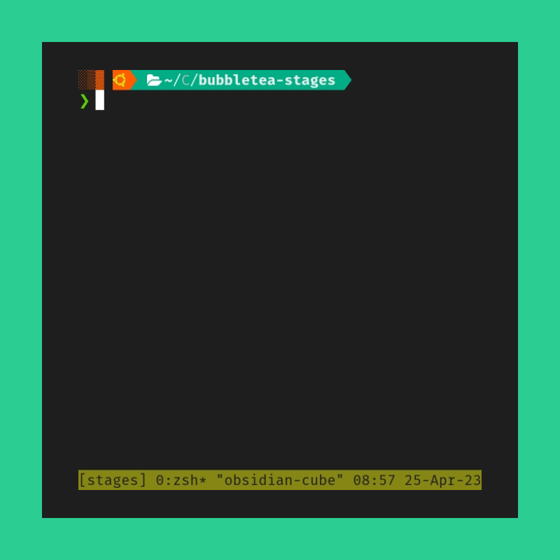

# Overview

This example repository demonstrates the Bubbletea State Machine pattern, which is ideal for building 
command line tools and other Terminal User Interfaces (TUI) that can orchestrate complex deployments for your users.

